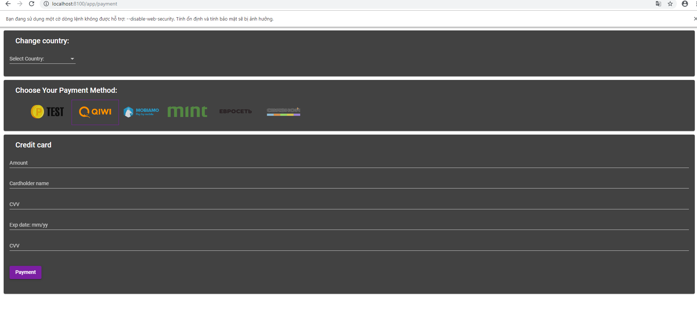

## RUN APP

```
  npm start
```

## Open browser disable sercurity | Add CORS for domain http://localhost:8100

```
  Windows + R &&
  "C:\Program Files (x86)\Google\Chrome\Application\chrome.exe" --disable-web-security --disable-gpu --user-data-dir=c:/chromeTemp
```

### Demo:


